# Jarkom-Modul-3-E17-2023
Kelompok E17 -
Jaringan Komputer (F) </br>
*Insitut Teknologi Sepuluh Nopember*

**Authors :**
| Name                  | Student ID |
| ----------------------|------------|
| Rizky Alifiyah Rahma  | 5025211208 |
| Dilla Wahdana         | 5025211234 |

## Soal 0
Topologi

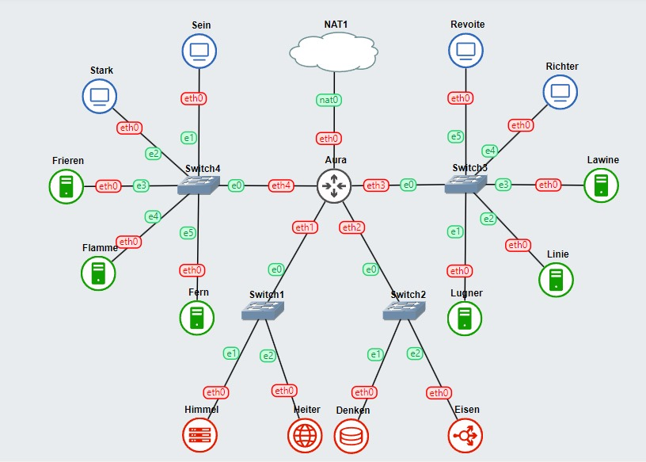

### Configurasi:
ROUTER - AURA
```
auto eth0
iface eth0 inet dhcp

auto eth1
iface eth1 inet static
	address 10.45.1.10
	netmask 255.255.255.0

auto eth2
iface eth2 inet static
	address 10.45.2.10
	netmask 255.255.255.0

auto eth3
iface eth3 inet static
	address 10.45.3.10
	netmask 255.255.255.0

auto eth4
iface eth4 inet static
	address 10.45.4.10
	netmask 255.255.255.0
```
[Switch 1]

HIMMEL
```
auto eth0
iface eth0 inet static
	address 10.45.1.1
	netmask 255.255.255.0
	gateway 10.45.1.10
```
HEITER
```
auto eth0
iface eth0 inet static
	address 10.45.1.2
	netmask 255.255.255.0
	gateway 10.45.1.10
```
[Switch 2]

DENKEN
```
auto eth0
iface eth0 inet static
	address 10.45.2.1
	netmask 255.255.255.0
	gateway 10.45.2.10
```
EISEN
```
auto eth0
iface eth0 inet static
	address 10.45.2.2
	netmask 255.255.255.0
	gateway 10.45.2.10
```
[Switch 3]

LAWINE
```
auto eth0
iface eth0 inet static
	address 10.45.3.1
	netmask 255.255.255.0
	gateway 10.45.3.0
```
LINIE
```
auto eth0
iface eth0 inet static
	address 10.45.3.2
	netmask 255.255.255.0
	gateway 10.45.3.0

auto eth0
iface eth0 inet dhcp

LUGNER
auto eth0
iface eth0 inet static
	address 10.45.3.3
	netmask 255.255.255.0
	gateway 10.45.3.0
```
REVOITE
```
auto eth0
iface eth0 inet static
	address 10.45.3.4
	netmask 255.255.255.0
	gateway 10.45.3.0
```
RICHTER
```
auto eth0
iface eth0 inet static
	address 10.45.3.5
	netmask 255.255.255.0
	gateway 10.45.3.0
```
[Switch 4]

FRIEREN
```
auto eth0
iface eth0 inet static
	address 10.45.4.1
	netmask 255.255.255.0
	gateway 10.45.4.0
```
FLAMME
```
auto eth0
iface eth0 inet static
	address 10.45.4.2
	netmask 255.255.255.0
	gateway 10.45.4.0
```
FERN
```
auto eth0
iface eth0 inet static
	address 10.45.4.3
	netmask 255.255.255.0
	gateway 10.45.4.0
```
SEIN
```
auto eth0
iface eth0 inet static
	address 10.45.4.4
	netmask 255.255.255.0
	gateway 10.45.4.0
```

## Soal 1
> lakukan register domain berupa riegel.canyon.yyy.com untuk worker Laravel dan granz.channel.yyy.com untuk worker PHP (0) mengarah pada worker yang memiliki IP [prefix IP].x.1.

### Script Pengerjaan
- Dilakukan setup terlebih dahulu pada Node Heiter (DNS Master) antara lain mengkoneksikan ke routernya menggunakan ``echo nameserver 192.168.122.1 > /etc/resolv.conf`` lalu Instalasi bind ``apt-get update`` dan ``apt-get install bind9 -y``
- Kemudian buat domain dengan nama ``canyon.E17.com`` dan ``channel.E17.com`` berikut sciptnya:
lakukan perintah dibawah dan isi konfigurasi domain ``canyon.E17.com`` dan ``channel.E17.com``
```
nano /etc/bind/named.conf.local
zone “canyon.E17.com” {
	type master;
	file “/etc/bind/jarkom/canyon.E17.com”;
};

zone “granz.channel.E17.com” {
	type master;
	file “/etc/bind/jarkom/channel.E17.com”;
};

zone "1.45.10.in-addr.arpa" {
    type master;
    file "/etc/bind/jarkom/1.45.10.in-addr.arpa";
};
```
Buat folder jarkom di dalam ``/etc/bind`` dan copykan file ``db.local`` ke folder ``jarkom`` yang baru saja dibuat
```
mkdir /etc/bind/jarkom

cp /etc/bind/db.local /etc/bind/jarkom/canyon.E17.com
cp /etc/bind/db.local /etc/bind/jarkom/channel.E17.com
cp /etc/bind/db.local /etc/bind/jarkom/1.45.10.in-addr.arpa
```
Kemudian buka file ``canyon.E17.com``, ``channel.E17.com``, ``1.45.10.in-addr.arpa`` dan edit syntaxnya dengan mengarah pada worker yang memiliki IP [prefix IP].x.1
```
nano /etc/bind/jarkom/canyon.E17.com
;
; BIND data file for local loopback interface
;
$TTL    604800
@       IN      SOA     canyon.E17.com. root.canyon.E17.com. (
                        2      ; Serial
                        604800         ; Refresh
                        86400         ; Retry
                        2419200         ; Expire
                        604800 )       ; Negative Cache TTL
;
@       IN      NS      canyon.E17.com.
@       IN      A       10.45.1.2 	; IP Heiter
riegel  IN      A       10.45.4.1	; IP Frieren

nano /etc/bind/jarkom/channel.E17.com
;
; BIND data file for local loopback interface
;
$TTL    604800
@       IN      SOA     channel.E17.com. root.channel.E17.com. (
                        2      ; Serial
                        604800         ; Refresh
                        86400         ; Retry
                        2419200         ; Expire
                        604800 )       ; Negative Cache TTL
;
@       IN      NS      channel.E17.com.
@       IN      A       10.45.1.2 	; IP Heiter
granz  IN      A       10.45.3.1	; IP Lawine

nano /etc/bind/jarkom/1.45.10.in-addr.arpa
;
; BIND data file for local loopback interface
;
$TTL	604800
@	IN	SOA	canyon.E17.com.	root.canyon.E17.com. (
				2		; Serial
			604800		; Refresh
			86400			; Retry
			2419200		; Expire
			604800		; Negative Cache TTL
;
1.45.10. In-addr.arpa.		IN	NS	canyon.E17.com.
2				IN	PTR	canyon.E17.com.
```
Pastikan konfigurasinya sudah sesuai, lalu restart bind9
```
service bind9 restart
```
- Lakukan ujicoba pada node Client dengan script berikut:
Hubungkan dengan router dan DNS Servernya
```
nano /etc/resolv.conf

Nameserver 192.168.122.1
Nameserver 10.45.1.2
```
Jalankan ``riegel.canyon.E17.com`` dan ``granz.channel.E17.com`` dengan command
```
ping riegel.canyon.E17.com
ping granz.channel.E17.com
```
### Hasil
ping riegel.canyon.E17.com

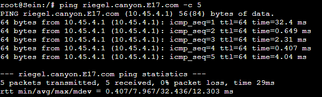

ping granz.channel.E17.com

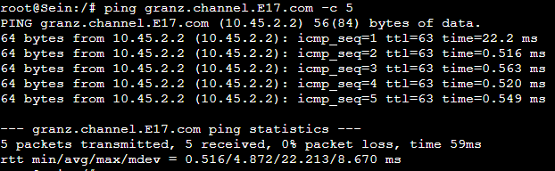

## Soal 2
> Semua CLIENT harus menggunakan konfigurasi dari DHCP Server. Client yang melalui Switch3 mendapatkan range IP dari [prefix IP].3.16 - [prefix IP].3.32 dan [prefix IP].3.64 - [prefix IP].3.80

### Script Pengerjaan
- Pada topologi ini, kita akan menjadikan Himmel sebagai DHCP Server. Oleh sebab itu, kita harus meng-install isc-dhcp-server di Himmel. sebelum melakukan instalasi lakukan update package lists di Himmel
```
apt-get update
apt-get install isc-dhcp-server
```
- Menentukan interface. interface dari Himmel yang menuju ke switch adalah eth0, maka kita akan memilih interface eth0 untuk diberikan layanan DHCP.
```
nano /etc/default/isc-dhcp-server
INTERFACESv4=”eth0”
```
- Edit file konfigurasi isc-dhcp-server pada /etc/dhcp/dhcpd.conf. Tambahkan Script Konfigurasi sebagai berikut:
```
nano /etc/dhcp/dhcpd.conf

subnet 10.45.1.0 netmask 255.255.255.0 {
}

subnet 10.45.2.0 netmask 255.255.255.0 {
}

subnet 10.45.3.0 netmask 255.255.255.0 {
    range 10.45.3.16 10.45.3.32;
    range 10.45.3.64 10.45.3.80;
    option routers 10.45.3.10;
}
host Lawine {
	hardware ethernet b2:d1:7c:b8:ff:5e;
	fixed-address 10.45.3.1;
}

host Linie {
	hardware ethernet 22:e4:a6:dc:b7:ab;
	fixed-address 10.45.3.2;
}

Host Lugner {
	hardware ethernet ea:0c:3b:a2:c7:77;
	fixed-address 10.45.3.3;
}
```
- Restart Service isc-dhcp-server Dengan Perintah
```
service isc-dhcp-server restart
service isc-dhcp-server status
```
- Perbarui configurasi dari masing-masing client dengan perintah
```
nano /etc/network/interfaces
auto eth0
iface eth0 inet dhcp
```
- Perbarui juga pada masing-masing worker dengan perintah
Lawine
```
nano /etc/network/interfaces
auto eth0
iface eth0 inet dhcp
hwaddress ether b2:d1:7c:b8:ff:5e
```
Linie
```
nano /etc/network/interfaces
auto eth0
iface eth0 inet dhcp
hwaddress ether 22:e4:a6:dc:b7:ab
```
Lugner
```
nano /etc/network/interfaces
auto eth0
iface eth0 inet dhcp
hwaddress ether ea:0c:3b:a2:c7:77
```

## Soal 3
> Client yang melalui Switch4 mendapatkan range IP dari [prefix IP].4.12 - [prefix IP].4.20 dan [prefix IP].4.160 - [prefix IP].4.168

### Script Pengerjaan
- Lanjutkan dari no.2 diatas dengan menambah file konfigurasi isc-dhcp-server pada /etc/dhcp/dhcpd.conf pada node Himmel. Tambahkan Script Konfigurasi sebagai berikut:
```
nano /etc/dhcp/dhcpd.conf
subnet 10.45.4.0 netmask 255.255.255.0 {
    range 10.45.4.12 10.45.4.32;
    range 10.45.4.160 10.45.4.168;
    option routers 10.45.4.10;
}

host Frieren {
	hardware ethernet 22:9f:e7:6d:1c:8f;
	fixed-address 10.45.4.1;
}

host Flamme {
	hardware ethernet b2:6c:77:81:3b:25;
	fixed-address 10.45.4.2;
}

host Fern {
	hardware ethernet 5a:03:2e:47:a5:5f;
	fixed-address 10.45.4.3;
}
```
- Restart Service isc-dhcp-server Dengan Perintah
```
service isc-dhcp-server restart
service isc-dhcp-server status
```

## Soal 4
> Client mendapatkan DNS dari Heiter dan dapat terhubung dengan internet melalui DNS tersebut

### Script Pengerjaan
- Lakukan beberapa instalasi sebelum melakukan konfigurasi pada Aura yang dijadikan sebagai DHCP Relay. Instalasi yang dilakukan adalah sebagai berikut.
```
apt-get update
apt-get install isc-dhcp-relay -y
service isc-dhcp-relay start
```
- Melakukan Konfigurasi pada isc-dhcp-relay pada Aura(router) dengan script berikut:
```
nano /etc/default/isc-dhcp-relay
SERVERS=”10.45.1.1”
INTERFACES=”eth1 eth2 eth3 eth4”
OPTIONS=””
```
- Melakukan Konfigurasi IP Forwarding pada /etc/sysctl.conf
```
nano /etc/sysctl.conf
net.ipv4.ip_forward=1
```
- Kemudian, restart service isc-dhcp-relay
```
service isc-dhcp-relay restart
```

## Soal 5
> Lama waktu DHCP server meminjamkan alamat IP kepada Client yang melalui Switch3 selama 3 menit sedangkan pada client yang melalui Switch4 selama 12 menit. Dengan waktu maksimal dialokasikan untuk peminjaman alamat IP selama 96 menit

### Script Pengerjaan
- Lanjutkan dari no.3 diatas dengan menambah file konfigurasi isc-dhcp-server pada /etc/dhcp/dhcpd.conf pada node Himmel, tambahkan lama waktu DHCP server meminjamkan alamat IP kepada Client. Berikut Script Konfigurasinya:
```
nano /etc/dhcp/dhcpd.conf
subnet 10.45.1.0 netmask 255.255.255.0 {
}

subnet 10.45.2.0 netmask 255.255.255.0 {
}

subnet 10.45.3.0 netmask 255.255.255.0 {
    range 10.45.3.16 10.45.3.32;
    range 10.45.3.64 10.45.3.80;
    option routers 10.45.3.10;
    option broadcast-address 10.45.3.255;
    option domain-name-servers 10.45.1.2;
    default-lease-time 180;
    max-lease-time 5760;
}

subnet 10.45.4.0 netmask 255.255.255.0 {
    range 10.45.4.12 10.45.4.32;
    range 10.45.4.160 10.45.4.168;
    option routers 10.45.4.10;
    option broadcast-address 10.45.4.255;
    option domain-name-servers 10.45.1.2;
    default-lease-time 720;
    max-lease-time 5760;
}
```
- Restart Service isc-dhcp-server Dengan Perintah
```
service isc-dhcp-server restart
service isc-dhcp-server status
```

### Hasil
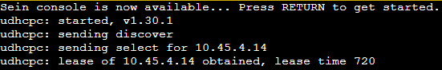

## Soal 6
> Berjalannya waktu, petualang diminta untuk melakukan deployment. Pada masing-masing worker PHP, lakukan konfigurasi virtual host untuk website ``berikut`` dengan menggunakan php 7.3

### Script Pengerjaan
- Pada masing-masing workernya konfigurasikan DNS nya, update package list dan install paket Nginx, php, dan php-fm, dan buat direktori baru bernama modul3 di dalam direktori /var/www
```
echo nameserver 192.168.122.1 > /etc/resolv.conf

apt-get update
apt-get install nginx -y
service nginx start
service nginx status

apt-get install php php-fpm -y
apt-get install wget -y
apt-get install unzip -y

mkdir /var/www/modul3
```
- Import file dari google drive yang disediakan untuk mengisi /var/www dari granz.channel.yyy.com
```
cd /var/www/modul3

wget –no-check-certificate 'https://docs.google.com/uc?export=download&id=1ViSkRq7SmwZgdK64eRbr5Fm1EGCTPrU1' -O granz.channel.yyy.com
```
- Lakukan unzip dan sesuaikan struktur folder untuk tepat berada di dalam /var/www/modul3
```
unzip granz.channel.yyy.com -d granz.channel.E17.com
rm granz.channel.yyy.com
mv granz.channel.E17.com/modul-3/* granz.channel.E17.com
rmdir granz.channel.E17.com/modul-3

mv granz.channel.E17.com/index.php /var/www/modul3/index.php
```
- Buat konfigurasi server Nginx dan menyimpannya dalam file /etc/nginx/sites-available/modul3. Konfigurasi ini mengatur Nginx untuk mendengarkan permintaan pada port 80, menetapkan root direktori ke /var/www/modul3, mengizinkan akses file PHP, dan mencatat error dan akses log.
```
nano /etc/nginx/sites-available/modul3
 server {

 	listen 80;

 	root /var/www/modul3;

 	index index.php index.html index.htm;
 	server_name _;

 	location / {
 			try_files $uri $uri/ /index.php?$query_string;
 	}

 	# pass PHP scripts to FastCGI server
 	location ~ \.php$ {
 	include snippets/fastcgi-php.conf;
 	fastcgi_pass unix:/var/run/php/php7.3-fpm.sock;
 	}

 location ~ /\.ht {
 			deny all;
 	}

 	error_log /var/log/nginx/jarkom_error.log;
 	access_log /var/log/nginx/jarkom_access.log;
 }
```
- Lalu buat symlink dari konfigurasi Nginx yang telah dibuat di dalam direktori sites-available, hapus konfigurasi default Nginx yang ada di dalam direktori sites-enabled. Mulai layanan php-fpm, restart php-fpm, reload konfigurasi Nginx, menerapkan perubahan yang baru saja dibuat, dan restart server Nginx.
```
ln -s /etc/nginx/sites-available/modul3 /etc/nginx/sites-enabled

rm -r /etc/nginx/sites-enabled/default

service nginx reload
service nginx restart
service php7.3-fpm start
```
- Lakukan testing pada Client dengan perintah
```
curl granz.channel.E17.com
```
### Hasil


## Soal 7
> Kepala suku dari ``Bredt Region`` memberikan resource server sebagai berikut:
a. Lawine, 4GB, 2vCPU, dan 80 GB SSD.
b. Linie, 2GB, 2vCPU, dan 50 GB SSD.
c. Lugner 1GB, 1vCPU, dan 25 GB SSD.
aturlah agar Eisen dapat bekerja dengan maksimal, lalu lakukan testing dengan 1000 request dan 100 request/second.

### Script Pengerjaan
- Buka kembali Node DNS Server dan arahkan domain tersebut pada IP Load Balancer Eisen
```
echo ‘
;
; BIND data file for local loopback interface
;
$TTL    604800
@       IN      SOA     channel.E17.com. root.channel.E17.com. (
                        2      ; Serial
                        604800         ; Refresh
                        86400         ; Retry
                        2419200         ; Expire
                        604800 )       ; Negative Cache TTL
;
@       IN      NS      channel.E17.com.
@       IN      A       10.45.1.2 	; IP Heiter
granz  IN      A       10.45.2.2	; LB
‘ > /etc/bind/jarkom/channel.E17.com
```
- Pada eisen load balancer, kita konfigurasi DNS nya dan update package list beserta install Nginx
```
echo nameserver 192.168.122.1 > /etc/resolv.conf

apt-get update
apt-get install nginx
```
- kemudian buat ``file/etc/resolv.conf`` dan isikan beberapa alamat DNSnya. Lalu buat juga file untuk membuat konfigurasi server Nginx yang mana konfigurasi ini mengatur Nginx untuk mendengarkan permintaan pada port 80 dan meneruskannya ke grup server yang ditentukan di dalam blok upstream.
```
nano /etc/resolv.conf
nameserver 10.45.1.2
nameserver 10.45.2.2

nano /etc/nginx/sites-available/lb-modul3
upstream webserver {
	server 10.45.3.1;
	server 10.45.3.2;
	server 10.45.3.3;
}

server {
	Listen 80;
	Server_name granz.channel.E17.com;

	location / {
        proxy_pass http://worker;
    }
	error_log /var/log/nginx/modul3_error.log;
 	access_log /var/log/nginx/modul3_access.log;
}

ln -s /etc/nginx/sites-available/lb-modul3 /etc/nginx/sites-enabled/
```
- Restart Service nginx Dengan Perintah
```
service nginx restart
service nginx status
```
- instalasi Apache benchmark pada client
```
apt-get update && apt-get install apache2-utils
```
- Lakukan testing website apache.org menggunakan Apache bencmark
```
ab -n 1000 -c 100 -g no7.data http://granz.channel.E17.com/
```
### Hasil
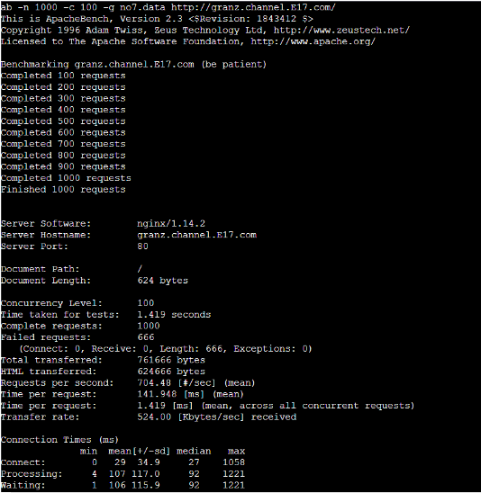
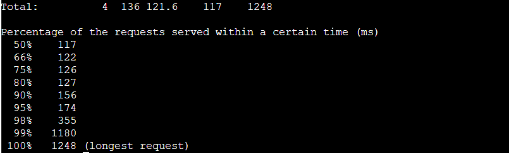

## Soal 8
> Karena diminta untuk menuliskan grimoire, buatlah analisis hasil testing dengan 200 request dan 10 request/second masing-masing algoritma Load Balancer dengan ketentuan sebagai berikut:
a. Nama Algoritma Load Balancer
b. Report hasil testing pada Apache Benchmark
c. Grafik request per second untuk masing masing algoritma. 
d. Analisis

### Script Pengerjaan
- konfigurasinya sama dengan Soal 7
- Lakukan testing pada masing-masing algoritma Load Balancer
Round robin
```
ab -n 200 -c 10 -g no8roundrobin.data http://granz.channel.E17.com/
```
Least connection
```
ab -n 200 -c 10 -g no8leastconn.data http://granz.channel.E17.com/
```
Ip hash
```
ab -n 200 -c 10 -g no8iphash.data http://granz.channel.E17.com/
```
Generic hash
```
ab -n 200 -c 10 -g no8generichash.data http://granz.channel.E17.com/
```
### Hasil
Round robin

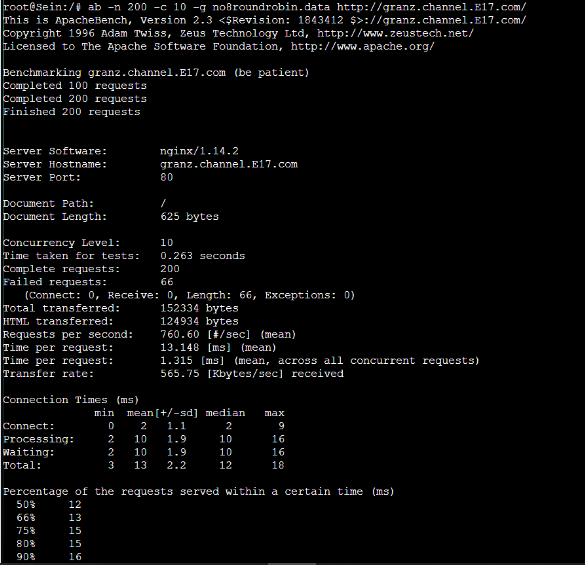
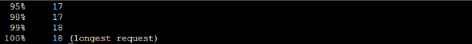

Least connection

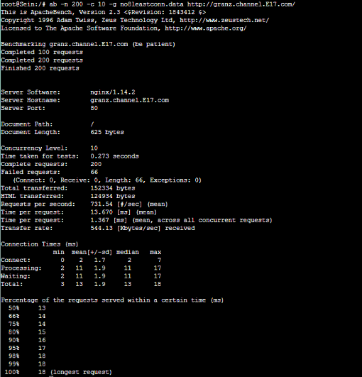

Ip hash

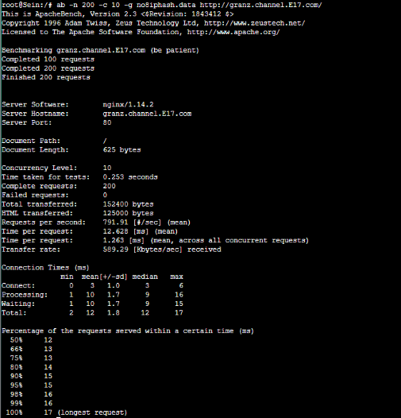

Generic hash

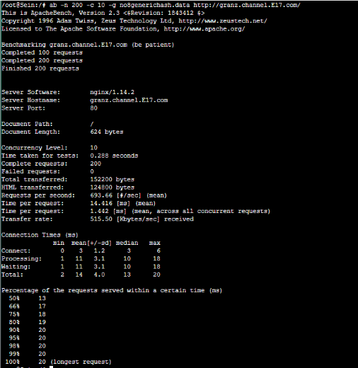

Grafik
Request Per Second

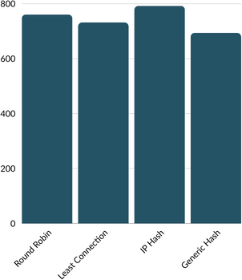

Time Taken

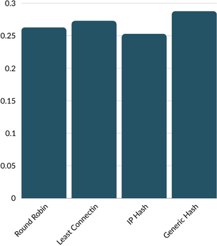

## Soal 9
> Dengan menggunakan algoritma Round Robin, lakukan testing dengan menggunakan 3 worker, 2 worker, dan 1 worker sebanyak 100 request dengan 10 request/second, kemudian tambahkan grafiknya pada grimoire.

### Script Pengerjaan
- Untuk menjalankan testing tiap jumlah worker, kita setup upstream yang terkoneksikan dengan worker
3 Worker 
- lakukan setup pada node Eisen dan jalankan load balancernya
```
Upstream:
server 10.45.3.1;
server 10.45.3.2;
server 10.45.3.3;
```
- Selanjutnya lakukan testing menggunakan 3 worker pada client
```
ab -n 100 -c 10 -g no9_3worker.data http://granz.channel.E17.com/
```
2 Worker 
- lakukan setup pada node Eisen dan jalankan load balancernya
```
Upstream:
#server 10.45.3.1;
server 10.45.3.2;
server 10.45.3.3;
```
- Selanjutnya lakukan testing menggunakan 2 worker pada client
```
ab -n 100 -c 10 -g no9_2worker.data http://granz.channel.E17.com/
```
1 Worker 
- lakukan setup pada node Eisen dan jalankan load balancernya
```
Upstream:
#server 10.45.3.1;
#server 10.45.3.2;
server 10.45.3.3;
```
- Selanjutnya lakukan testing menggunakan 1 worker pada client
```
ab -n 100 -c 10 -g no9_1worker.data http://granz.channel.E17.com/
```
### Hasil
3 Worker

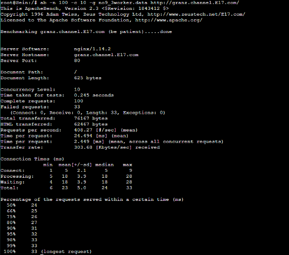

2 worker

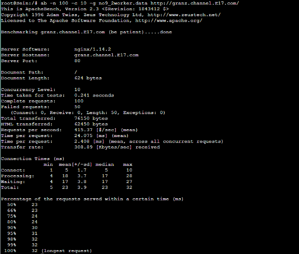

1 worker

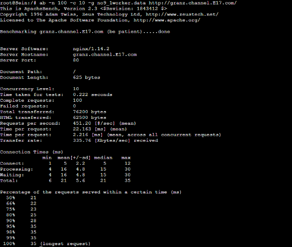

grafik
Request Per Second

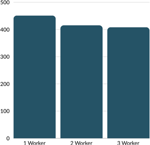

Time Taken

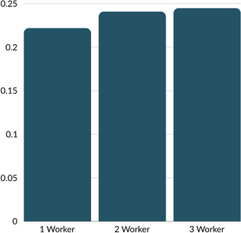

## Soal 10
> Selanjutnya coba tambahkan konfigurasi autentikasi di LB dengan dengan kombinasi username: “netics” dan password: “ajkyyy”, dengan yyy merupakan kode kelompok. Terakhir simpan file “htpasswd” nya di /etc/nginx/rahasisakita/

### Script Pengerjaan
- Generate user dan password menggunakan htpasswd
```
mkdir /etc/nginx/rahasiakita
htpasswd -c -b /etc/nginx/rahasiakita/.htpasswd netics ajke17
```
- Lalu, masukkan passwordnya ``ajke17``. Jika sudah memasukkan password dan re-type password.
- Edit konfigurasi Auth Basic pada ``/etc/nginx/sites-available/lb-modul3`` di node Load Balancer (Eisen) dengan script sebagai berikut:
```
upstream webserver  {
        server 10.45.3.1;
        server 10.45.3.2;
        server 10.45.3.3;
 }

 server {
        listen 80;
        server_name granz.channel.E17.com;

        location / {
                proxy_pass http://webserver;
                auth_basic "Administrator's Area";
                auth_basic_user_file /etc/nginx/rahasiakita/.htpasswd;
        }

        location ~ /\.ht {
                deny all;
        }
 }
```
- Lakukan testing pada client dengan perintah
```
ab -A netics:ajke17 -n 100 -c 100 http://granz.channel.E17.com/
```
### Hasil
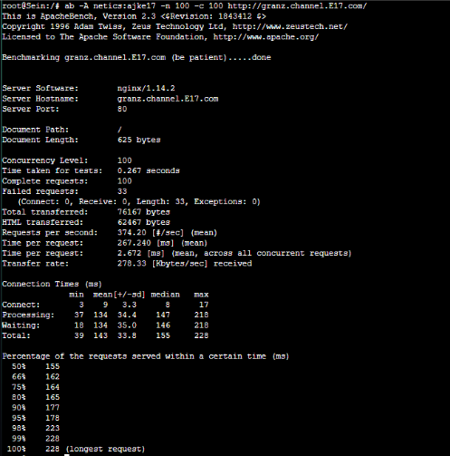

curl granz.channel.E17.com

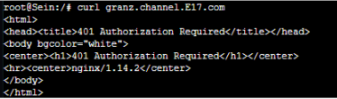

lynx granz.channel.E17.com

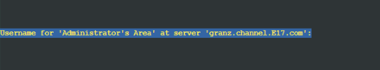
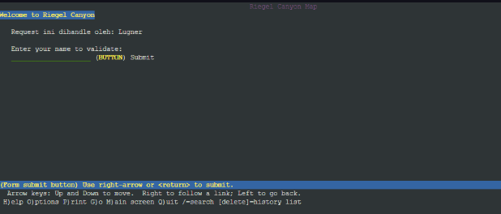

## Soal 11
> Lalu buat untuk setiap request yang mengandung /its akan di proxy passing menuju halaman ``https://www.its.ac.id.``

### Script Pengerjaan
- Edit konfigurasi pada Eisen. Ketika kita melakukan akses pada endpoint yang mengandung /its akan diarahkan oleh proxy_pass menuju https://www.its.ac.id
```
upstream webserver  {
        server 10.45.3.1;
        server 10.45.3.2;
        server 10.45.3.3;
 }

 server {
        listen 80;
        server_name granz.channel.E17.com;

        location / {
                proxy_pass http://webserver;
                auth_basic "Administrator's Area";
                auth_basic_user_file /etc/nginx/rahasiakita/.htpasswd;
        }
        location ~* /its {
                proxy_pass https://www.its.ac.id;
        }


        location ~ /\.ht {
                deny all;
        }
 }
```
- Lakukan testing pada client dengan perintah
```
lynx granz.channel.E17.com/its
```
### Hasil
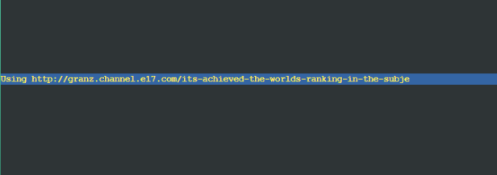
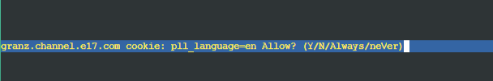
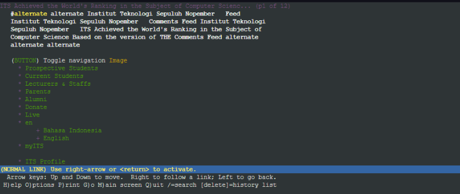

## Soal 12
> Selanjutnya LB ini hanya boleh diakses oleh client dengan IP [Prefix IP].3.69, [Prefix IP].3.70, [Prefix IP].4.167, dan [Prefix IP].4.168.

### Script Pengerjaan
- Edit konfigurasi pada Eisen dengan beberapa ketentuan di soal.
- Disini kami hanya mengizinkan beberapa IP saja sesuai dengan ketentual soal dan kamu menolak seluruh IP selain yang telah ditentukan soal. Untuk melakukan testingnya. Bisa dilakukan dengan membuka client yang mendapatkan IP 192.173.3.69 atau 192.173.3.70 atau 192.173.4.167 atau 192.173.4.168
```
upstream webserver  {
        server 10.45.3.1;
        server 10.45.3.2;
        server 10.45.3.3;
 }

 server {
        listen 80;
        server_name granz.channel.E17.com;

        location / {
                proxy_pass http://webserver;
                auth_basic "Administrator's Area";
                auth_basic_user_file /etc/nginx/rahasiakita/.htpasswd;

allow 10.45.3.69;
	allow 10.45.3.70;
	allow 10.45.3.167;
	allow 10.45.3.168;
	
	deny all;
        }
        location ~* /its {
                proxy_pass https://www.its.ac.id;
	allow all;
        }


        location ~ /\.ht {
                deny all;
        }
 }
```
### Hasil


## Soal 13
> Karena para petualang kehabisan uang, mereka kembali bekerja untuk mengatur riegel.canyon.yyy.com.
Semua data yang diperlukan, diatur pada Denken dan harus dapat diakses oleh Frieren, Flamme, dan Fern.

### Script Pengerjaan
- Setup terlebih dahulu pada Node Denke (Database Master) antara lain mengkoneksikan ke routernya, mengupdate packagenya, serta  instalasi mysql-server agar aplikasi Laravel yang kita buat terkoneksi dengan database
```
echo nameserver 192.168.122.1  > /etc/resolv.conf
apt-get update
apt-get install mariadb-server -y
```
- Kemudian nyalakan service mysql dengan perintah berikut
```
service mysql restart
```
- Lakukan konfigurasi mysql sebagai berikut dengan yyy merupakan kode kelompok:
```
CREATE USER 'kelompoke17'@'%' IDENTIFIED BY 'ajke17';
CREATE USER 'kelompoke17'@'localhost' IDENTIFIED BY 'ajke17';
CREATE DATABASE dbe17;
GRANT ALL PRIVILEGES ON *.* TO 'kelompoke17'@'%';
GRANT ALL PRIVILEGES ON *.* TO 'kelompoke17'@'localhost';
FLUSH PRIVILEGES;
```
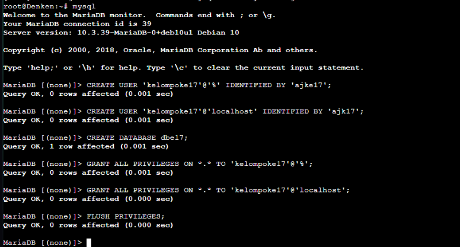
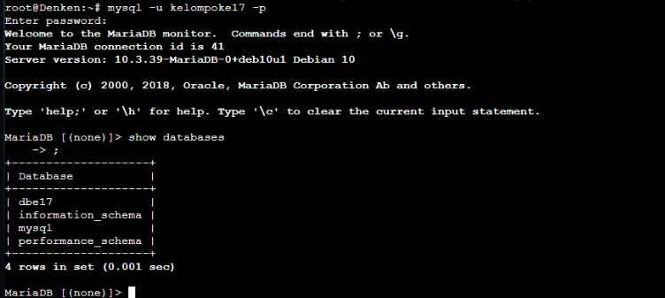
- Untuk mengecek apakah database sudah dapat diakses melalui Worker, lakukan instalasi mariadb-client pada Worker1 sebagai berikut:
```
apt-get update
apt-get install mariadb-client -y
```
- Setelah itu lakukan pengecekan di salah satu Laravel Worker. Disini kami akan melakukan pengecekan pada worker Fern dengan melakukan perintah shell berikut
```
mariadb –host=10.45.2.1 –port=3306 –user=kelompoke17 –password=ajke17
```
### Hasil


## Soal 14
> Frieren, Flamme, dan Fern memiliki Riegel Channel sesuai dengan ``quest guide`` berikut. Jangan lupa melakukan instalasi PHP8.0 dan Composer

### Script Pengerjaan
- lakukan update package-list dengan command:
```
apt-get update
```
- Lakukan instalasi package yang diperlukan untuk menambahkan repository PHP.
```
apt-get install -y lsb-release ca-certificates apt-transport-https software-properties-common gnupg2
```
- unduh GPG-key dan tambahkan dengan perintah berikut:
```
curl -sSLo /usr/share/keyrings/deb.sury.org-php.gpg https://packages.sury.org/php/apt.gpg
```
- Tambahkan entri repositori baru untuk paket PHP Ondrej Sury ke worker dengan perintah berikut:
```
sh -c 'echo "deb [signed-by=/usr/share/keyrings/deb.sury.org-php.gpg] https://packages.sury.org/php/ $(lsb_release -sc) main" > /etc/apt/sources.list.d/php.list'
```
- Setelah itu install git dan lakukan cloning terhadap resource yang telah diberikan
```
git clone https://github.com/martuafernando/laravel-praktikum-jarkom.git
cp -r laravel-praktikum-jarkom /var/www/
```
- lakukan konfigurasi sebagai berikut pada masing-masing worker.
```
nano /root/.env
APP_NAME=Laravel
APP_ENV=local
APP_KEY=
APP_DEBUG=true
APP_URL=http://localhost

LOG_CHANNEL=stack
LOG_DEPRECATIONS_CHANNEL=null
LOG_LEVEL=debug

DB_CONNECTION=mysql
DB_HOST=10.45.2.1
DB_PORT=3306
DB_DATABASE=dbe17
DB_USERNAME=kelompoke17
DB_PASSWORD=ajke17

BROADCAST_DRIVER=log
CACHE_DRIVER=file
FILESYSTEM_DISK=local
QUEUE_CONNECTION=sync
SESSION_DRIVER=file
SESSION_LIFETIME=120

MEMCACHED_HOST=127.0.0.1

REDIS_HOST=127.0.0.1
REDIS_PASSWORD=null
REDIS_PORT=6379

MAIL_MAILER=smtp
MAIL_HOST=mailpit
MAIL_PORT=1025
MAIL_USERNAME=null
MAIL_PASSWORD=null
MAIL_ENCRYPTION=null
MAIL_FROM_ADDRESS="hello@example.com"
MAIL_FROM_NAME="${APP_NAME}"

AWS_ACCESS_KEY_ID=
AWS_SECRET_ACCESS_KEY=
AWS_DEFAULT_REGION=us-east-1
AWS_BUCKET=
AWS_USE_PATH_STYLE_ENDPOINT=false

PUSHER_APP_ID=
PUSHER_APP_KEY=
PUSHER_APP_SECRET=
PUSHER_HOST=
PUSHER_PORT=443
PUSHER_SCHEME=https
PUSHER_APP_CLUSTER=mt1

VITE_PUSHER_APP_KEY="${PUSHER_APP_KEY}"
VITE_PUSHER_HOST="${PUSHER_HOST}"
VITE_PUSHER_PORT="${PUSHER_PORT}"
VITE_PUSHER_SCHEME="${PUSHER_SCHEME}"
VITE_PUSHER_APP_CLUSTER="${PUSHER_APP_CLUSTER}"
```
- Setelah itu, update dan install vendor dengan perintah berikut pada direktori laravel-simple-rest-api
```
cp .env /var/www/laravel-praktikum-jarkom

cd /var/www/laravel-praktikum-jarkom
composer update
composer install
```
- Setelah env selesai diset, jalankan perintah berikut pada Worker:
```
php artisan migrate:fresh
php artisan db:seed --class=AiringsTableSeeder
```
Perintah di atas akan melakukan migrasi tabel dari Laravel ke Database dan akan melakukan seed data pada class AiringTableSeeder ke database.
- Lakukan pengecekan pada database di terminal workernya dengan perintah
```
mariadb –host=10.45.2.1 –port=3306 –user=kelompoke17 –password=ajke17
SELECT * FROM airings
```
- Generate key pada project laravel dengan perintah berikut:
```
php artisan key:generate
php artisan jwt:secret
```
- Untuk melakukan deployment pada masing-masing worker, tambahkan virtual host pada file ``/etc/nginx/sites-available/modul3``
```
(pastiin port tiap worker berbeda)
nano /etc/nginx/sites-available/modul3
 server {

 	listen 8001; #8001 Frieren, 8002 Flamme, 8003 Fern

 	root /var/www/modul3;

 	index index.php index.html index.htm;
 	server_name _;

 	location / {
 			try_files $uri $uri/ /index.php?$query_string;
 	}

 	# pass PHP scripts to FastCGI server
 	location ~ \.php$ {
 	include snippets/fastcgi-php.conf;
 	fastcgi_pass unix:/var/run/php/php7.3-fpm.sock;
 	}

 location ~ /\.ht {
 			deny all;
 	}

 	error_log /var/log/nginx/implementasi_error.log;
 	access_log /var/log/nginx/implementasi_access.log;
 }
```
- Setelah selesai, buat symlink untuk melakukan enable pada site dengan perintah:
```
ln -s /etc/nginx/sites-available/modul3 /etc/nginx/sites-enabled/
```
- Kemudian, untuk memastikan bahwa server web (diasumsikan berjalan sebagai www-data) memiliki izin yang diperlukan untuk mengelola dan mengakses direktori penyimpanan maka jalankan perintah berikut:
```
chown -R www-data.www-data /var/www/laravel-praktikum-jarkom/storage
```
- Jalankan service php-fpm dengan perintah berikut:
```
service php8.0-fpm restart
service nginx restart
```
### Hasil


## Soal 15
> Riegel Channel memiliki beberapa endpoint yang harus ditesting sebanyak 100 request dengan 10 request/second. Tambahkan response dan hasil testing pada grimoire.
a. POST /auth/register

### Script Pengerjaan
- Untuk mengerjakan soal ini. Diperlukan melakukan testing menggunakan Apache Benchmark pada salah satu worker saja.
```
nano /root/login_data.json
{“username”:”ikikganteng”,”password”:”ajke17”}
```
- Lakukan testing pada terminal client dengan perintah sebagai berikut
```
ab -n 100 -c 10 -T 'application/json' -p register3_data.json -g register3_results.data http://10.45.4.1:8001/api/auth/register
```
### Hasil
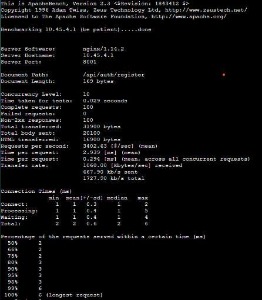

## Soal 16
> Riegel Channel memiliki beberapa endpoint yang harus ditesting sebanyak 100 request dengan 10 request/second. Tambahkan response dan hasil testing pada grimoire.
b. POST /auth/login

### Script Pengerjaan
curl -X POST -H "Content-Type: application/json" -d '{"username": "bubub", "password": "000000"}' http://10.45.4.1:8001/api/auth/login | jq -r '.token' > token.txt
### Hasil
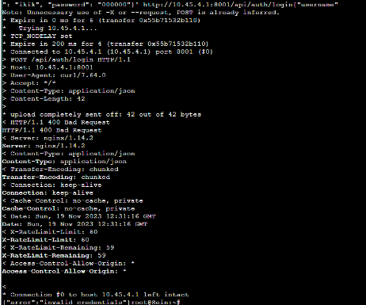

## Sola 17
> Riegel Channel memiliki beberapa endpoint yang harus ditesting sebanyak 100 request dengan 10 request/second. Tambahkan response dan hasil testing pada grimoire.
> c. GET /me

### Script Pengerjaan
- Dapatkan tokennya terlebih dahulu sebelum mengakses endpoint /api/me
```
token=$(cat token.txt); curl -H "Authorization: Bearer $token" http://10.45.4.1:8001/api/me
```
- Setelah itu jalankan perintah berikut untuk melakukan testing
```
token=$(cat token.txt); ab -n 1000 -c 10 -H "Authorization: Bearer $token" http://10.45.4.1:8001/api/me
```
- Cek 100 request sekalius di worker (Frieren):
```
nano /var/log/nginx/implementasi_access.log
```
- Cek di danken:
```
mysql -u kelompoke17 -p ajke17
use dbe17;
Select * from users;
```
### Hasil
Frieren

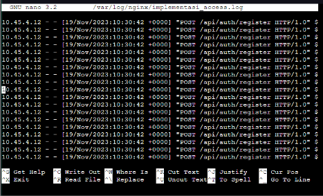

Danken

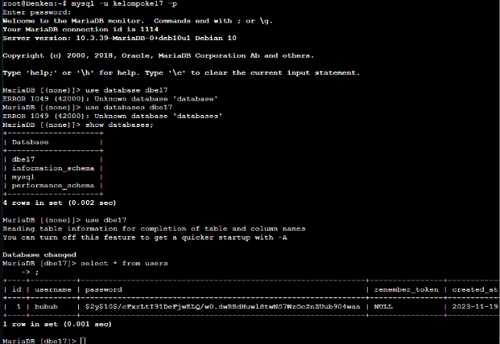

## Soal 18
> Untuk memastikan ketiganya bekerja sama secara adil untuk mengatur Riegel Channel maka implementasikan Proxy Bind pada Eisen untuk mengaitkan IP dari Frieren, Flamme, dan Fern.

### Script Pengerjaan
- Edit pada node Eisen dengan script berikut
```
echo ‘
upstream webserver  {
        server 10.45.4.1:8001;
        server 10.45.4.2:8002;
        server 10.45.4.3:8003;
 }

 server {
        listen 80;
        server_name riegel.canyon.E17.com;

        location / {
        proxy_bind 10.45.2.2;
        proxy_pass http://webserver;
        }
 }
‘ > /etc/nginx/sites-available/lb-modul3-laravel

ln -s /etc/nginx/sites-vailable/lb-modul3-laravel /etc/nginx/sites-enabled
```
- Restart Nginx dengan perintah
```
service nginx restart
service nginx status
```
### Hasil
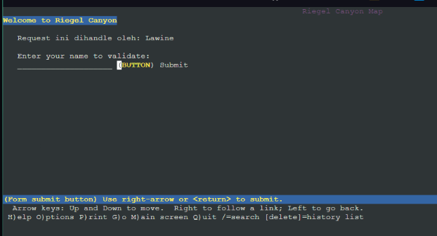

## Soal 19
> Untuk meningkatkan performa dari Worker, coba implementasikan PHP-FPM pada Frieren, Flamme, dan Fern. Untuk testing kinerja naikkan 
> - pm.max_children
> - pm.start_servers
> - pm.min_spare_servers
> - pm.max_spare_servers

> sebanyak tiga percobaan dan lakukan testing sebanyak 100 request dengan 10 request/second kemudian berikan hasil analisisnya pada Grimoire.

### Script Pengerjaan
- cp template ke root dulu pake ini (run-nya di root)
```
cp /etc/php/8.0/fpm/pool.d/www.conf ./
```
- Kemudian copy buat backup
```
cp www.conf template1
```
- pm.max_children Menentukan jumlah maksimum pekerja PHP (proses anak) yang dapat berjalan secara bersamaan. Nilai ini sebaiknya disesuaikan dengan kapasitas sumber daya server. Jika terlalu rendah, server mungkin tidak dapat menangani banyak permintaan secara bersamaan, sementara jika terlalu tinggi, dapat menyebabkan kelebihan beban dan kekurangan sumber daya.

pm.start_servers Menentukan jumlah pekerja PHP yang akan dimulai secara otomatis ketika PHP-FPM pertama kali dijalankan atau direstart. Ini membantu dalam mengoptimalkan performa pada saat server pertama kali dimulai.

pm.min_spare_servers Menentukan jumlah minimum pekerja PHP yang tetap berjalan saat server berjalan. Ini membantu menjaga agar server tetap responsif terhadap permintaan bahkan saat lalu lintas rendah.

pm.max_spare_servers Menentukan jumlah maksimum pekerja PHP yang dapat berjalan tetapi tidak menangani permintaan. Jumlah ini disesuaikan dengan kebutuhan untuk menangani lonjakan lalu lintas tanpa menambahkan terlalu banyak sumber daya ketika beban rendah.
### Script
Percobaan 1
```
Template1 diganti: 
; Start a new pool named 'www'.
; the variable $pool can be used in any directive and will be replaced by the
; pool name ('www' here)

[www]

user = www-data
group = www-data
listen = /run/php/php8.0-fpm.sock
listen.owner = www-data
listen.group = www-data
php_admin_value[disable_functions] = exec,passthru,shell_exec,system
php_admin_flag[allow_url_fopen] = off

; Choose how the process manager will control the number of child processes.

pm = dynamic
pm.max_children = 5
pm.start_servers = 2 
pm.min_spare_servers = 1
pm.max_spare_servers = 3 

; Per pool prefix
; It only applies on the following directives:
; - 'access.log'
; - 'slowlog'
; - 'listen' (unixsocket)
; - 'chroot'
; - 'chdir'
; - 'php_values'

cp template1 /etc/php/8.0/fpm/pool.d/www.conf
service php8.0-fpm restart

```
Percobaan 2
```
cp template1 template2
nano template2

Ubah ininya:
pm = dynamic
pm.max_children = 5
pm.start_servers = 2 
pm.min_spare_servers = 2
pm.max_spare_servers = 5 

cp template2 /etc/php/8.0/fpm/pool.d/www.conf
service php8.0-fpm restart
```
Percobaan 3
```
cp template2 template3
nano template3

Ubah ininya:
pm = dynamic
pm.max_children = 5
pm.start_servers = 1 
pm.min_spare_servers = 2
pm.max_spare_servers = 5 

cp template3 /etc/php/8.0/fpm/pool.d/www.conf
service php8.0-fpm restart
```
- Lakukan testing pada client dengan perintah berikut
```
ab -n 100 -c 10 -T 'application/json' -p register3_data.json -g register3_results.data http://riegel.canyon.E17.com/api/auth/register
```
### Hasil
Percobaan 1

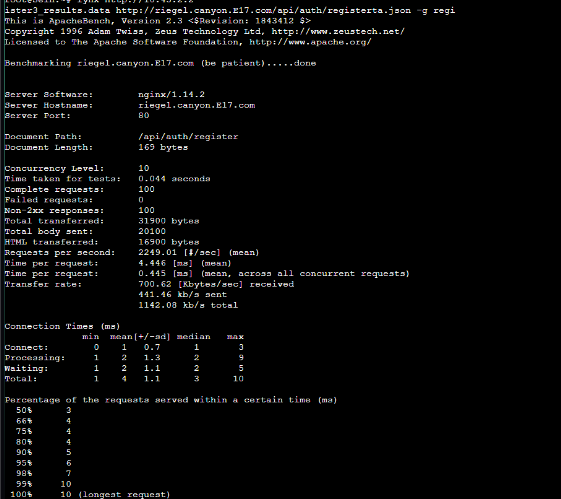

Percobaan 2

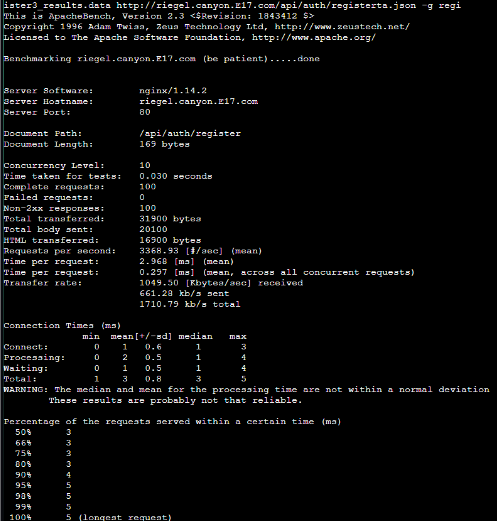

Percobaan 3
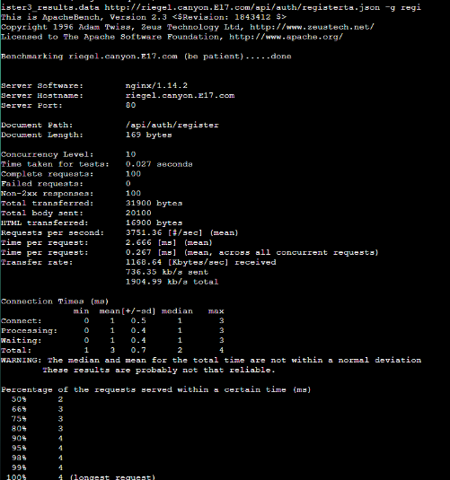

## Soal 20
> Nampaknya hanya menggunakan PHP-FPM tidak cukup untuk meningkatkan performa dari worker maka implementasikan Least-Conn pada Eisen. Untuk testing kinerja dari worker tersebut dilakukan sebanyak 100 request dengan 10 request/second.

### Script Pengerjaan
- Lakukan perubahan pada ``/etc/nginx/sites-available/lb-modul3-laravel`` dengan script berikut
```
upstream webserver  {
 least_conn;
        server 10.45.4.1:8001;
        server 10.45.4.2:8002;
        server 10.45.4.3:8003;
 }

 server {
        listen 80;
        server_name riegel.canyon.E17.com;

        location / {
        proxy_bind 10.45.2.2;
        proxy_pass http://webserver;
        }
 }
```
- Kemudian restart Nginx dengan perintah
```
service nginx restart
```
- Lakukan testing pada client
```
ab -n 100 -c 10 -T 'application/json' -p register3_data.json -g register3_results.data http://riegel.canyon.E17.com/api/auth/register 
```
### Hasil
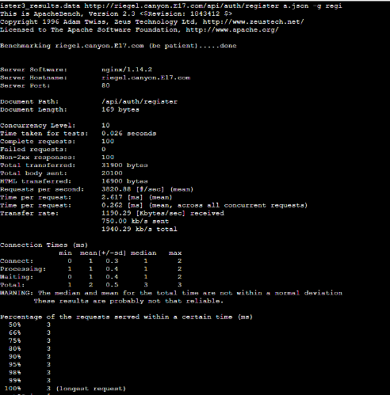
